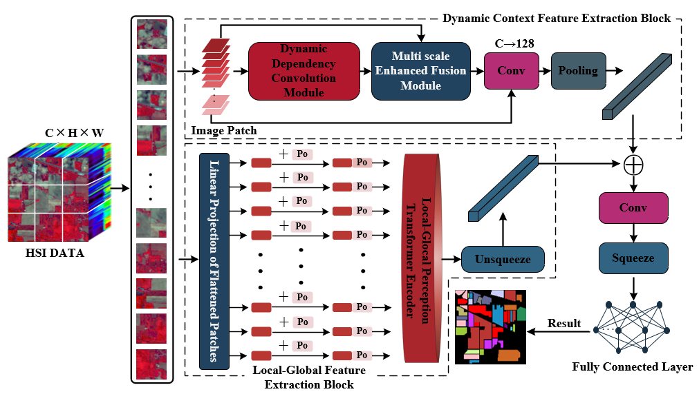

# LRDTN：Spectral-Spatial Convolutional Fusion Long-Range Dependency Transformer Network for Hyperspectral Image Classification

This is the official PyTorch code for the paper:

**LRDTN：Spectral-Spatial Convolutional Fusion Long-Range Dependency Transformer Network for Hyperspectral Image Classification**

***IEEE Transaction on Geoscience and Remote Sensing***

**Shujie Ding**, **Xiaoli Ruan**,**Jing Yang***, **Chengjiang Li**, **Jie Sun**, **Xianghong Tang and Zhidong Su**.

**[**Code**](https://github.com/ybyangjing/LRDTN)

<p align="center">
  
</p>


## Setup

The model code is implemented based on the PyTorch framework. The experimental environment includes:

- Intel(R) Core(TM) i7-11700k CPU
- 32GB RAM
- NVIDIA GeForce RTX 3080Ti GPU

## Model
```
netword.py
```


The complete code will be uploaded after the paper is accepted.

**If you have any questions you can contact us : sjding22@gzu.edu.cn**
